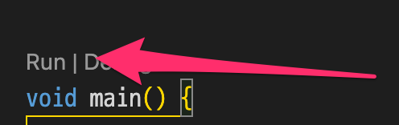
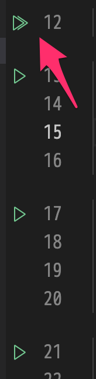

tdd_demo_dart
===========

## ゴール

TDDスタイルの実装を用いて [Red-Green-Refactor のサイクル](https://scrapbox.io/docodoor/テスト駆動開発#67c7e4b9727aaf0000c2a94f)を体感して感触を掴む

## テストコード

- `test/uset_test.dart` にテストコードがあります。
- `test/example.dart` は、テストコードの完成版で、このサンプルではテスト実行の対象外のファイルです。


## シナリオ

架空のAPIからのレスポンスボディから、ドメインモデル User に変換できる仕組みを作成します。

- API のレスポンスボディ形式のオブジェクトにデシリアライズする(UserApiRequest)
- UserApiRequest インスタンスからドメインモデル User に変換する処理を実装する
- Userクラスの仕様を策定して実装する

＊レスポンスボディは json 形式で構成されている、という想定です。

## セットアップ

### fvm

```bash
$ fvm use
```

### 依存関係(テストスイート)をインストール

```bash
$ fvm dart pub get
```

このサンプルのテストフレームワークは `flutter_test` (Flutterプロジェクト作成時に設定されている物) を使用しています。

## テストの実行

以下のいずれかでテストを実行できます。

### 方法１

VSCodeでテストコードを開くと Run というボタンが表示されるので、これを押すとテストが実行されます。



### 方法２

行番号の横の緑色のアイコンを押すと、該当箇所のみのテストが実行されます。



